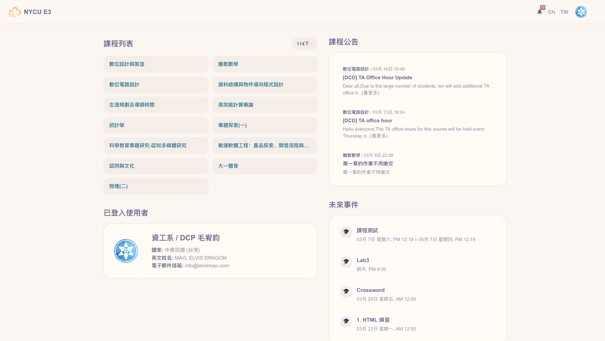
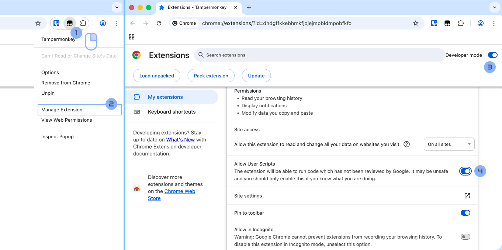

# NYCU EM3

E3 很難用很醜，所以我寫了一個 NYCU E3 的外觀修改套件。使用 Tampermonkey 等類似工具安裝後，會對 NYCU E3 的全站介面進行最佳化，提升使用體驗。

## 使用方式

請先安裝 [Tampermonkey](https://www.tampermonkey.net/)（或其他類似的 userscript 管理器），並且至 [Greasy Fork 頁面](https://greasyfork.org/en/scripts/568460-nycu-e3-ui-plus)點擊安裝。

如果你是使用 Chrome 或是基於 Chromium 的瀏覽器（例如 Edge、Brave 等），記得先打開 Allow User Scripts 的選項，才能讓套件正常運作。

## 開發

本地開發可以使用 dev.js 進行開發。

1. 在 Tampermonkey 等套件管理器中新增一個腳本並貼上 dev.js 的內容。
2. 在本地開一個 HTTP 伺服器（如 [VS Code Live Server 擴充功能](https://marketplace.visualstudio.com/items?itemName=ritwickdey.LiveServer)）並將 `dev.js` 中的 `BASE` 修改為對應的本地 URL（例如 `http://127.0.0.1:8000/`）。

這樣你在本地編輯 `index.js` 後，刷新 NYCU E3 頁面就能看到變更。

## Credits

毛哥EM製作，使用 [Rosé Pine Dawn](https://rosepinetheme.com/) 配色方案。

本專案採用*阿帕切二點零*授權條款釋出，詳見 [LICENSE](LICENSE)。
